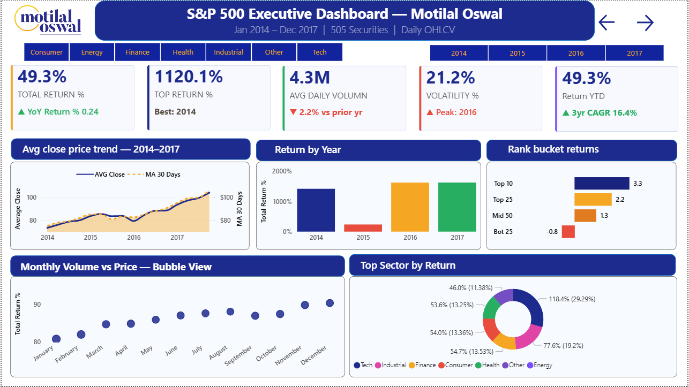

<div align="center">


# 📊 S&P 500 Stock Market Analytics Dashboard
### Built with Power BI Desktop · DAX · S&P 500 Dataset (2014–2017)

[](https://github.com/Arghyajyoti007)
[](https://github.com/Arghyajyoti007)
[](https://powerbi.microsoft.com/)
[](https://github.com/Arghyajyoti007)
[](https://github.com/Arghyajyoti007)
[](https://github.com/Arghyajyoti007)

</div>

---

## ✅ Project Status

> **All 3 pages are complete and fully functional.**

| Page | Title | Status | Key Visuals |
|------|-------|--------|-------------|
| Page 1 | Executive Overview | ✅ Complete | 5 KPI Cards, Trend, Waterfall, Donut, Rank Buckets |
| Page 2 | Stock Deep Dive | ✅ Complete | OHLC, Volume, Scatter, Sector Lines, Top 10 Table |
| Page 3 | Risk & Portfolio Intelligence | ✅ Complete | Quadrant Map, Heatmap, Treemap, Volatility Tiles, 6 Advanced Measures |

---

## 📌 Project Overview

A **3-page professional Power BI dashboard** built on S&P 500 stock price data (2014–2017), simulating a real-world financial analytics report for **Motilal Oswal Financial Services**.

This project demonstrates end-to-end **Business Intelligence skills** — from raw CSV ingestion and Power Query transformation, to advanced DAX measure engineering (30+ measures), to executive-grade dashboard design with drillthrough, cross-page slicer sync, conditional formatting, treemaps, heatmaps, and waterfall charts.

**Dataset:** 497,000+ rows · 505 stock symbols · 7 columns (`symbol`, `date`, `open`, `high`, `low`, `close`, `volume`)

---

## 🖥️ Dashboard Preview

### Page 1 — Executive Overview
> High-level market performance overview for portfolio managers and senior analysts.


**Key visuals:**
- **5 KPI Cards** — Total Return % (+ YoY label), Top Return % (+ Best Year), Avg Daily Volume (+ % vs prior yr), Volatility % (+ Peak Year), Return YTD (+ 3yr CAGR)
- **Avg Close Price Trend** — Line chart with 30-Day Moving Average overlay (navy area + gold dashed line)
- **Return by Year** — Column chart (2014–2017) with conditional coloring (navy = positive, red = negative)
- **Month-over-Month Price Change** — Waterfall chart showing running price change per month (navy = up, red = down)
- **Top Sector by Return** — Donut chart grouped by sector (Tech, Finance, Health, Energy, Consumer, Industrial)
- **Rank Bucket Returns** — Horizontal bar chart (Top 10 / Top 25 / Mid 50 / Bot 25 / Bot 10)
- **Slicers** — Year (tile), Sector (dropdown), Date Range (between slider)

---

### Page 2 — Stock Deep Dive
> Drillthrough page for individual stock analysis. Symbol and Year slicers filter all visuals simultaneously.


**Key visuals:**
- **4 KPI Cards** — Total Return % (+ Rank X/Y), MA 30 Days (+ Above/Below avg), Avg Volume (+ Liquidity label), Volatility % (+ vs Market avg)
- **Price Movement** — OHLC line chart (Avg High = green dashed, Avg Low = red dashed, AVG Close = navy solid)
- **Daily Volume with AVG Line** — Bar chart with gold dashed average volume reference line + % vs avg tooltip
- **Return vs Volume Treemap** — Top 30 stocks; rectangle size = volume, colour = return (replaced scatter for richer insight)
- **Monthly Return % by Sector** — Multi-series line chart (one coloured line per sector, Jan–Dec)
- **Top 10 Stocks Table** — Ranked table with data bars on Return %, icon sets on Volatility %, sparklines on close price
- **Slicers** — Symbol (tile, scrollable), Year (tile)

---

### Page 3 — Risk & Portfolio Intelligence
> Advanced analytics page with volatility analysis, risk-return mapping, and finance-grade KPI measures.



**Key visuals:**
- **Risk-Return Quadrant Map** — Scatter chart with average reference lines dividing into 4 quadrants (Star / Aggressive / Stable / Avoid)
- **MA 30 Days vs Close Price** — Dual-line chart with shaded gap area (navy close + gold MA)
- **Volatility % KPI Tiles** — Top 6 most volatile stocks; color-coded (Red > 30%, Orange 25–30%, Gold 20–25%, Navy 15–20%, Green < 20%)
- **Volatility Distribution Chart** — Column chart showing count of stocks per volatility bucket (< 15% to > 30%)
- **Monthly Return Heatmap** — Year × Month matrix with 5-color gradient conditional formatting (Red → Gray → Navy)
- **6 Advanced DAX Measure Cards** — Sharpe Ratio, Price Range %, Volume Surge Flag, Beta Approximation, Drawdown %, Momentum Score

---

## ⚙️ DAX Measures — Complete List (30+)

All measures are stored in a dedicated `Measures` blank table inside the `.pbix` file. Organised into 3 files in the `dax/` folder.

### Core Measures (`dax/core_measures.dax`)

| Measure | Formula Summary | Used In |
|---------|----------------|---------|
| `AVG Volumn` | `AVERAGE(volume)` | All pages |
| `Avg Close Price` | `AVERAGE(close)` | P1 trend, P2 OHLC, P3 MA |
| `MA 30 Days` | `CALCULATE(AVG(close), DATESINPERIOD(-30 DAY))` | P1 overlay, P2 card |
| `Total Return %` | `DIVIDE(LastPrice - FirstPrice, FirstPrice) * 100` | All pages |
| `Yearly Return %` | `DIVIDE(DecClose - JanClose, JanClose) * 100` | P1 bar chart |
| `Return YTD` | `DIVIDE(YearEnd - YearStart, YearStart) * 100` | P1 card, P2 table |
| `Monthly Return %` | `DIVIDE(MonthEnd - MonthStart, MonthStart) * 100` | P2 sector line, P3 heatmap |
| `Stock Rank` | `RANKX(ALL(symbol), [Total Return %],, DESC, DENSE)` | P1 bar, P2 table & card |
| `Top Return %` | `MAXX(ALL(symbol), [Total Return %])` | P1 KPI card |
| `Rank Worst` | `MAXX(ALL(symbol), [Stock Rank])` | P2 card subtitle |
| `Volatility %` | `STDEVX.P(DailyReturn) * SQRT(252) * 100` | All pages |
| `Daily Volume` | `SUM(volume)` | P2 volume bar chart |
| `Avg High` | `AVERAGE(high)` | P2 OHLC line |
| `Avg Low` | `AVERAGE(low)` | P2 OHLC line |
| `Bucket Return` | `SWITCH(SELECTEDVALUE(Bucket), CALCULATE+FILTER per bracket)` | P1 rank bar |
| `Stock Count` | `COUNTROWS(VALUES(symbol))` | P3 distribution chart |

### Helper Measures — Card Subtitles (`dax/helper_measures.dax`)

| Measure | Output Example | Card |
|---------|---------------|------|
| `Top Stock Year` | `"Best: 2014"` | P1 Top Return % subtitle |
| `Peak Vol Year` | `"Peak: 2016"` | P1 Volatility % subtitle |
| `YoY Return Label` | `"▲ YoY Return % 0.24"` | P1 Total Return % subtitle |
| `CAGR 3Y` | `"▲ 3yr CAGR 16.4%"` | P1 Return YTD subtitle |
| `AVG Volumn PY` | Number (prior year avg) | P1 volume card calculation |
| `Volume Change Label` | `"▼ 2.2% vs prior yr"` | P1 Avg Volume subtitle |
| `Latest Close` | Number (scalar) | P2 MA comparison |
| `MA Position Label` | `"Below 30d avg"` | P2 MA 30 Days subtitle |
| `Volume Liquidity Label` | `"Medium liquidity"` | P2 Avg Volume subtitle |
| `Avg Mkt Vol` | Number (market avg volatility) | P2 volatility comparison |
| `Volatility Position Label` | `"▼ Below market avg"` | P2 Volatility % subtitle |
| `Rank Label` | `"Rank 232 / 484"` | P2 Total Return % subtitle |
| `Vol vs Avg %` | `"vs Avg: +32.4%"` | P2 volume tooltip |
| `Total Symbols` | `505` | Data quality check card |

### Additional Finance-Grade Measures (`dax/additional_measures.dax`)

| Measure | Formula Summary | Finance Purpose |
|---------|----------------|-----------------|
| `Sharpe Ratio` | `DIVIDE([Return YTD], [Volatility %])` | Risk-adjusted return quality |
| `Price Range %` | `DIVIDE(AVG(high) - AVG(low), AVG(close)) * 100` | Intraday volatility intensity |
| `Volume Surge Flag` | `IF(CurrentVol > 2 × BaselineVol, "SURGE", "Normal")` | Market event detection |
| `Beta Approximation` | `DIVIDE(StockRet, IndexRet)` using daily CALCULATE | Market sensitivity coefficient |
| `Drawdown %` | `DIVIDE(CurrentClose - PeakClose, PeakClose) * 100` | Peak-to-trough risk measure |
| `Momentum Score` | `DIVIDE(Return3M, ABS(Return6M))` | Trend acceleration indicator |
| `Risk Category` | `SWITCH(Vol > 30 → "High", > 20 → "Medium", "Low")` | Stock risk classification |
| `Return Category` | `SWITCH vs market avg` | Performance tier classification |
| `Avg Return All Stocks` | `CALCULATE([Total Return %], ALL(symbol))` | Market benchmark return |
| `Avg Volatility All Stocks` | `CALCULATE([Volatility %], ALL(symbol))` | Market benchmark volatility |
| `Price to MA Ratio` | `DIVIDE(LatestClose - MA, MA) * 100` | Momentum signal indicator |
| `Heatmap Value` | `[Monthly Return %]` blank-safe | P3 heatmap matrix values |
| `Volatility Risk Label` | `"HIGH RISK" / "MEDIUM" / "LOW RISK"` | P3 tile color trigger |

---

## 🔧 Calculated Columns

| Column | Table | Formula Summary |
|--------|-------|----------------|
| `Year` | Stock Prices | `YEAR(date)` — via Power Query |
| `Month` | Stock Prices | `MONTH(date)` — via Power Query |
| `MonthName` | Stock Prices | Month name — sorted by MonthNumber |
| `MonthNumber` | Stock Prices | `MONTH(date)` — used to sort MonthName |
| `Quarter` | Stock Prices | `QUARTER(date)` — via Power Query |
| `Sector` | Stock Prices | `SWITCH(TRUE(), symbol IN {...}, "Tech", ...)` |
| `Vol Bucket` | Symbol Volatility Table | `SWITCH(VolatilityPct < 15, "< 15%", ...)` |
| `Vol Bucket Label` | Symbol Volatility Table | Clean display labels sorted by Vol Bucket |

---

## 📊 Special Visuals Used

| Visual | Page | Why Used |
|--------|------|----------|
| **Waterfall Chart** | P1 | Month-over-month price change — shows up/down months at a glance |
| **Treemap** | P2 | Return vs Volume — size = liquidity, colour = return — richer than scatter |
| **Matrix Heatmap** | P3 | Year × Month return — 5-colour conditional formatting gradient |
| **Volatility Distribution** | P3 | Column chart with Symbol Volatility Table — counts stocks per risk bucket |
| **Scatter Quadrant Map** | P3 | Risk-Return with reference lines dividing 4 analyst quadrants |
| **Multi-Row Card Tiles** | P3 | Volatility % per stock with conditional background colour rules |
| **OKViz Candlestick** | P2 | Optional — custom visual from AppSource for true OHLC candlestick |

---

## 🗂️ Repository Structure

```
sp500-powerbi-dashboard/
│
├── 📁 assets/                              # Screenshots and preview images
│   ├── page1_executive_overview.png
│   ├── page2_stock_deep_dive.png
│   ├── page3_risk_portfolio.png
│   └── motilal_oswal_logo.png
│
├── 📁 data/                                # Source dataset
│   └── S_P_500_Stock_Prices_2014-2017.csv  # 497K rows, 7 columns
│
├── 📁 dax/                                 # All DAX measures as plain text files
│   ├── core_measures.dax                   # 16 core measures + Sector column
│   ├── helper_measures.dax                 # 14 subtitle & label measures
│   └── additional_measures.dax            # 15 finance-grade measures
│
├── 📁 docs/                                # Documentation
│   ├── dashboard_explanation.pdf           # Full explanation document (PDF)
│   ├── dax_replication_guide.docx          # Step-by-step build guide (Word)
│   └── chart_data_mappings.md             # X/Y axis specs for all 14 charts
│
├── 📄 S&P500_Motilal_Dashboard.pbix        # Main Power BI file
├── 📄 README.md                            # This file
└── 📄 LICENSE
```

---

## 🚀 How to Run This Project

### Prerequisites
- Power BI Desktop (free) — [Download here](https://powerbi.microsoft.com/en-us/desktop/)
- The `.pbix` file from this repository

### Steps
```
1. Clone or download this repository
2. Open Power BI Desktop
3. File > Open > select S&P500_Motilal_Dashboard.pbix
4. If prompted for data source, point it to:
   data/S_P_500_Stock_Prices_2014-2017.csv
5. Click Refresh — all visuals will populate automatically
6. Use the Symbol slicer on Page 2 to explore individual stocks
7. Use the Year slicer to compare 2014 vs 2015 vs 2016 vs 2017
```

### Recreate from Scratch
If you want to build it yourself from the raw CSV:
```
1. Import data/S_P_500_Stock_Prices_2014-2017.csv into Power BI
2. Follow docs/dax_replication_guide.docx for Power Query setup
   (add Year, Month, MonthName, MonthNumber, Quarter columns)
3. Create all measures in order:
   → dax/core_measures.dax       (create first)
   → dax/helper_measures.dax     (depends on core)
   → dax/additional_measures.dax (depends on core + helper)
4. Build visuals as mapped in docs/chart_data_mappings.md
5. Apply Motilal Oswal custom theme (Navy #1E2B8E + Gold #F5A623)
```

### ⚠️ Important Notes
- Create measures in order — helper measures depend on core measures
- `MonthName` must be sorted by `MonthNumber` or months show alphabetically
- `Volatility Distribution` chart uses `Symbol Volatility Table` — a calculated table, not the raw data table
- `SAMEPERIODLASTYEAR()` requires a Date Table marked as Date Table in Power BI

---

## 🛠️ Tech Stack

| Tool | Purpose |
|------|---------|
| **Power BI Desktop** | Dashboard design, visual layer, publishing |
| **DAX (Data Analysis Expressions)** | 30+ KPI measures, calculated columns, calculated tables |
| **Power Query (M Language)** | Data transformation, type conversion, date column engineering |
| **S&P 500 CSV Dataset** | 497K rows of daily OHLCV stock data (2014–2017) |
| **OKViz Candlestick** | Custom AppSource visual for OHLC candlestick chart |
| **Motilal Oswal Brand** | Color palette: Navy #1E2B8E · Gold #F5A623 |

---

## 📈 Key Insights Uncovered

- **NVDA** delivered **1,120% total return** from 2014–2017 — #1 of 505 stocks, driven by GPU and AI boom
- **Tech sector** contributed **29.29%** of total returns — dominant across all 4 years
- **August 2015** showed maximum volatility — visible as a red waterfall bar + volume spike — S&P flash crash
- **Top 10 stocks** returned **3.3x** vs **-0.8x** for bottom 25 — stock selection within the index matters enormously
- **MA 30 Days crossover** in 2016–2017 signals sustained bullish momentum — visible on P1 trend + P3 MA chart
- **Energy sector** showed highest volatility — visible in P3 volatility tiles and P3 heatmap (red months cluster)
- **Finance sector** showed best risk-adjusted Sharpe Ratio — high return relative to volatility
- **Volume Surge** events correlate with major market moves — earnings, Fed announcements, geopolitical events

---

## 🐛 Known Issues & Fixes Applied

| Issue | Fix Applied |
|-------|-------------|
| Months showing alphabetically | Sort `MonthName` by `MonthNumber` in Column Tools |
| `Total Return %` only showing 2014 | Replaced `FIRSTDATE(ALL())` with `FILTER(ALL(), date = MINX(...))` |
| `Vol Bucket` calculated column failing | Created `Symbol Volatility Table` using `ADDCOLUMNS` instead |
| Beta measure syntax error | Replaced nested `AVERAGEX` with separate `CALCULATE(AVERAGE(), ALL())` calls |
| Dual-axis Volume vs Price confusing | Replaced with Waterfall chart (month-over-month price change) |
| KPI cards not updating on month click | Removed `ALL()` wrappers — let measures respect filter context naturally |
| Heatmap showing as blue block | Switched from line chart to Matrix visual with gradient conditional formatting |

---

## 👤 Author

**Arghyajyoti Samui**
Associate Data Scientist | Power BI | DAX | Python | Machine Learning | NLP

[](https://www.linkedin.com/in/arghyajyoti-samui/)
[](https://github.com/Arghyajyoti007)
[](mailto:arghyajyoti.samui0201@gmail.com)

---

## 🏷️ Topics

`powerbi` `power-bi-desktop` `dax` `power-query` `pbix` `data-analytics` `data-visualization` `business-intelligence` `financial-analytics` `stock-market-analysis` `sp500` `stock-prices` `ohlcv` `market-data` `investment-analytics` `kpi-dashboard` `interactive-dashboard` `data-modeling` `time-intelligence` `conditional-formatting` `dax-measures` `m-language` `data-analysis` `exploratory-data-analysis` `etl` `portfolio-project` `resume-project` `data-analyst-portfolio` `job-portfolio` `treemap`

---

## 📄 License

This project is licensed under the MIT License — feel free to use, adapt, and share with attribution.

---

<div align="center">

⭐ **If this project helped you, please give it a star!** ⭐

*Built as a portfolio project demonstrating real-world Power BI, DAX, and financial analytics skills*

*3 Pages · 30+ DAX Measures · 14 Chart Visuals · 497K Rows · 505 Stocks*

</div>
