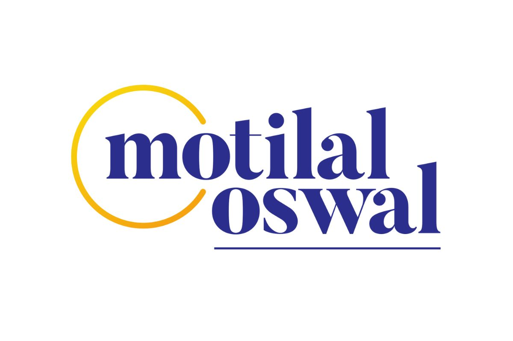
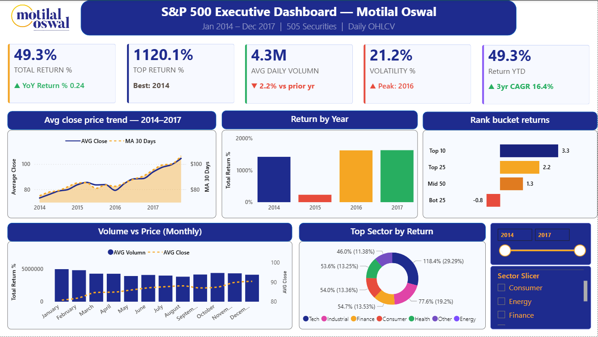
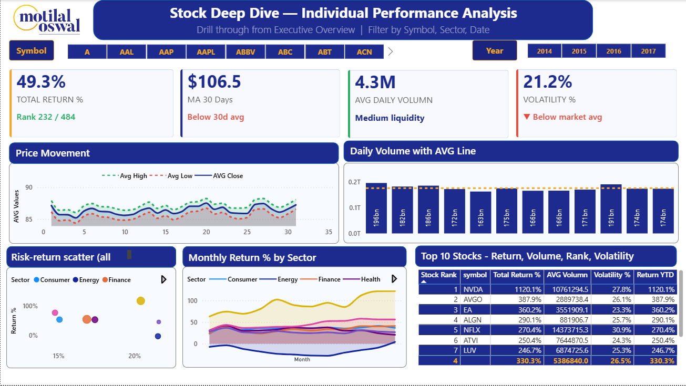

<div align="center">



# 📊 S&P 500 Stock Market Analytics Dashboard
### Built with Power BI Desktop · DAX · S&P 500 Dataset (2014–2017)

[](https://github.com/Arghyajyoti007)
[](https://github.com/Arghyajyoti007)
[](https://powerbi.microsoft.com/)
[](https://github.com/Arghyajyoti007)
[](https://github.com/Arghyajyoti007)

</div>

---

## 🚧 Project Status

> **This project is actively in development.**
> Pages 1 and 2 are complete and fully functional.
> **Page 3 (Risk & Portfolio Intelligence)** is currently being built and will be pushed shortly.

| Page | Title | Status |
|------|-------|--------|
| Page 1 | Executive Overview | ✅ Complete |
| Page 2 | Stock Deep Dive — Individual Performance | ✅ Complete |
| Page 3 | Risk & Portfolio Intelligence | 🔄 In Progress |

---

## 📌 Project Overview

A **3-page professional Power BI dashboard** built on S&P 500 stock price data (2014–2017), simulating a real-world financial analytics report for **Motilal Oswal Financial Services**.

This project demonstrates end-to-end **Business Intelligence skills** — from raw CSV ingestion and Power Query transformation, to advanced DAX measure engineering, to executive-grade dashboard design with drillthrough, cross-filtering, and conditional formatting.

**Dataset:** 497,000+ rows · 505 stock symbols · 7 columns (`symbol`, `date`, `open`, `high`, `low`, `close`, `volume`)

---

## 🖥️ Dashboard Preview

### Page 1 — Executive Overview
> High-level market performance overview for portfolio managers and senior analysts.



**Key visuals:**
- 5 KPI cards — Total Return %, Top Return %, Avg Volume, Volatility %, Return YTD
- Avg Close Price Trend with 30-Day Moving Average overlay
- Return by Year (2014–2017) column chart
- Volume vs Price Monthly combo chart
- Top Sector by Return donut chart
- Rank Bucket Returns horizontal bar chart

---

### Page 2 — Stock Deep Dive
> Drillthrough page for individual stock analysis. Symbol and Year slicers filter all visuals simultaneously.



**Key visuals:**
- 4 KPI cards — Total Return %, MA 30 Days, Avg Volume, Volatility %
- OHLC Price Movement line chart (High / Low / Close)
- Daily Volume with Avg Volume reference line
- Risk-Return scatter plot (Volatility % vs Total Return %)
- Monthly Return % by Sector multi-line chart
- Top 10 Stocks ranked table with conditional formatting and icon sets

---

### Page 3 — Risk & Portfolio Intelligence *(Coming Soon)*
> Advanced analytics page with volatility gauges, return heatmap, and quadrant analysis.


**Planned visuals:**
- Risk-Return Quadrant Map scatter chart
- Volatility % KPI tiles (color-coded: Red > 30%, Orange 20–30%, Green < 20%)
- MA 30 Days vs Close Price dual-line chart
- Monthly Return Heatmap (Year × Month matrix with 5-color conditional formatting)
- Sharpe Ratio, Drawdown %, Momentum Score advanced DAX measures

---

## ⚙️ DAX Measures Built

All 15+ measures are stored in a dedicated `Measures` table inside the `.pbix` file.

| Measure | Formula Summary | Used In |
|---------|----------------|---------|
| `AVG Volumn` | `AVERAGE(volume)` | All pages |
| `MA 30 Days` | `CALCULATE(AVG(close), DATESINPERIOD(-30 days))` | P1 trend, P2 card |
| `Total Return %` | `DIVIDE(LastPrice - FirstPrice, FirstPrice) * 100` | All pages |
| `Return YTD` | `DIVIDE(YearEnd - YearStart, YearStart) * 100` | P1 card, P2 table |
| `Yearly Return %` | Jan-to-Dec return per year | P1 bar chart |
| `Monthly Return %` | `DIVIDE(MonthEnd - MonthStart, MonthStart) * 100` | P2 sector chart |
| `Stock Rank` | `RANKX(ALL(symbol), [Total Return %],, DESC, DENSE)` | P2 table, P1 bar |
| `Top Return %` | `MAXX(ALL(symbol), [Total Return %])` | P1 KPI card |
| `Rank Worst` | `MAXX(ALL(symbol), [Stock Rank])` | P2 subtitle |
| `Volatility %` | `STDEVX.P(DailyReturn) * SQRT(252) * 100` | All pages |
| `Top Stock Year` | `TOPN(1, ALL(Year), [Total Return %])` | P1 subtitle |
| `Peak Vol Year` | `TOPN(1, ALL(Year), [Volatility %])` | P1 subtitle |
| `CAGR 3Y` | `(POWER(1 + Return/100, 1/3) - 1) * 100` | P1 subtitle |
| `YoY Return %` | `DATESYTD current - DATESYTD prior year` | P1 subtitle |
| `AVG Volumn PY` | `CALCULATE([AVG Volumn], SAMEPERIODLASTYEAR(date))` | P1 volume card |

---

## 🗂️ Repository Structure

```
sp500-powerbi-dashboard/
│
├── 📁 assets/                          # Screenshots and preview images
│   ├── page1_executive_overview.png
│   ├── page2_stock_deep_dive.png
│   ├── page3_coming_soon.png
│   └── motilal_oswal_logo.png
│
├── 📁 data/                            # Source dataset
│   └── S_P_500_Stock_Prices_2014-2017.csv
│
├── 📁 dax/                             # All DAX measures as plain text
│   ├── core_measures.dax               # 10 core measures
│   ├── helper_measures.dax             # Subtitle & label measures
│   └── additional_measures.dax        # Sharpe, Drawdown, Momentum etc.
│
├── 📁 docs/                            # Documentation
│   ├── dashboard_explanation.pdf       # Full explanation document
│   ├── dax_replication_guide.docx      # Step-by-step build guide
│   └── chart_data_mappings.md         # X/Y axis specs for every chart
│
├── 📄 S&P500_Motilal_Dashboard.pbix    # Main Power BI file
├── 📄 README.md                        # This file
└── 📄 LICENSE
```

---

## 🚀 How to Run This Project

### Prerequisites
- Power BI Desktop (free) — [Download here](https://powerbi.microsoft.com/en-us/desktop/)
- The `.pbix` file from this repository

### Steps
```
1. Clone or download this repository
2. Open Power BI Desktop
3. File > Open > select S&P500_Motilal_Dashboard.pbix
4. If prompted for data source, point it to: data/S_P_500_Stock_Prices_2014-2017.csv
5. Click Refresh — all visuals will populate automatically
```

### Recreate from Scratch
If you want to build it yourself from the raw CSV:
```
1. Import data/S_P_500_Stock_Prices_2014-2017.csv into Power BI
2. Follow docs/dax_replication_guide.docx for Power Query setup
3. Create all measures from dax/core_measures.dax
4. Build visuals as mapped in docs/chart_data_mappings.md
```

---

## 🛠️ Tech Stack

| Tool | Purpose |
|------|---------|
| **Power BI Desktop** | Dashboard design, visual layer |
| **DAX (Data Analysis Expressions)** | All KPI measures, calculated columns |
| **Power Query (M Language)** | Data transformation, date columns |
| **S&P 500 CSV Dataset** | 497K rows of OHLCV stock data |
| **Motilal Oswal Brand** | Color palette (#1E2B8E navy, #F5A623 gold) |

---

## 📈 Key Insights Uncovered

- **NVDA** delivered **1,120% total return** from 2014–2017 — the #1 performer in the S&P 500
- **Tech sector** contributed **29.29%** of total sector returns — the dominant category
- **2015 August** showed maximum volatility — visible as a volume spike + price dip in the combo chart
- **Top 10 stocks** averaged **3.3x returns** vs **-0.8x** for the bottom 25 — stock selection matters
- **MA 30 Days crossover** is visible in 2016 and 2017 as a strong bullish signal

---

## 👤 Author

**Arghyajyoti Samui**
Associate Data Scientist | Power BI | Python | Machine Learning

[](https://www.linkedin.com/in/arghyajyoti-samui/)
[](https://github.com/Arghyajyoti007)
[](mailto:arghyajyoti.samui0201@gmail.com)

---

## 📄 License

This project is licensed under the MIT License — feel free to use, adapt, and share with attribution.

---

<div align="center">

⭐ **If this project helped you, please give it a star!** ⭐

*Built as a portfolio project demonstrating real-world Power BI and DAX skills*

</div>
